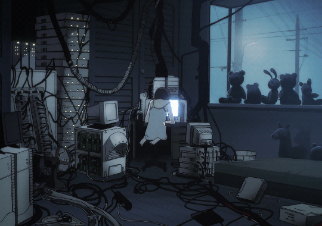

# A3NG3L

**`Cybersecurity Researcher · TryHackMe Top 5% · IT @ Securitas`**

## About

I'm a ethical hacker — I break things to understand them.
I spend my time grinding TryHackMe rooms (Top 5%), running labs in VMs, and figuring out how systems actually work under the hood.
You'll also catch me studying for Security+ & eJPT, in PortSwigger labs, or scripting tools in Python.
On the side I ran an AI-driven content campaign that hit 10M+ views on one video.
When I'm offline i will be praying reading or playing chess.

Currently working through **Security+ → eJPT → specialization**.*.

### 🧰 Languages and Tools

### 🎓 Certifications

- ✅ **ISC2 Certified in Cybersecurity (CC)**
- 🎯 **CompTIA Security+** — self-study, target June 2026
- 🎯 **eJPT** — in pipeline, target July 2026
- 🛠️ **CCNA** — completion target June 2026

### 📌 What's in this profile

- **TryHackMe Writeups** — public walkthroughs across web, AD, privesc, network
- **Python Security Tooling** — automation scripts for scanning and monitoring
- **Raspberry Pi Remote Monitoring** — SSH-secured environmental monitoring system
- **AI Content Project** — campaign architecture from a 10M+ view single-video launch

### 🔗 Elsewhere

- 🐧 TryHackMe: [a3ng3l](https://tryhackme.com/p/a3ng3l)
- 💼 LinkedIn: [coming soon]
- 🌐 Blog: [A3NG3L.github.io](https://A3NG3L.github.io) *(coming soon)*

### 📊 Stats

